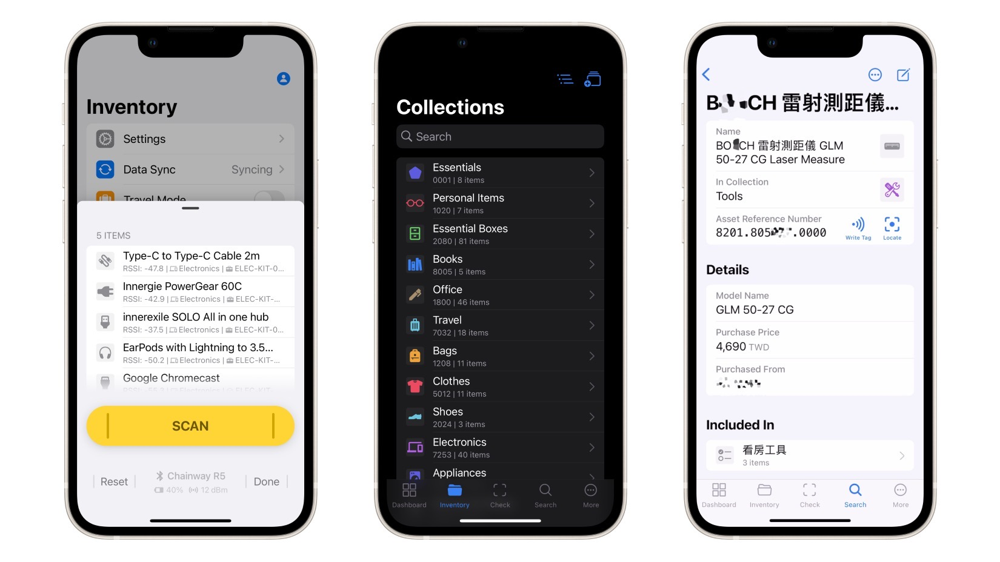

# Inventory

An RFID asset management solution for home or small businesses. https://youtu.be/SPdiQ89HPxo

## Get notified when the app is released

Waitlist (?): https://forms.gle/2gpQgXFeggUMXfoY6

Or also watch this repo for updates.

## Compatible RFID UHF Devices

See: https://hackmd.io/@Inventory/RFID-Readers

Recommendations for adding new devices are welcome!

## Download

This app is in early development and might have breaking changes. To try it out, [contact @zetavg](#contact) for the `.apk` file for Android or TestFlight installation for iOS.

## Build

The app is written with React Native (TypeScript), with native modules written in Java and Objective-C to handle UART/Bluetooth communications and full-text searching.

The source code is not ready for public release yet. I still need some time to check and remove sensitive information from the repo. If you are interested in the development, please [contact @zetavg](#contact).

## Contact

Via [Twitter (@zetavg)](https://twitter.com/zetavg), Telegram or Discord (zetavg#9110). Feel free to ping me multiple times if you didn't get a reply.
